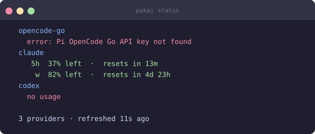

# PakAI (`pakai`)

> **Disclaimer**: This project was written 100% using AI.

Unified AI subscription usage tracker. Surface Claude, OpenAI Codex, and OpenCode usage — per provider, per window (5h / weekly / monthly) — directly in your tmux status bar, Waybar panel, KDE Plasma widget, CLI, or a TUI dashboard.



## Features

- **Multi-provider**: Claude (OAuth), OpenAI Codex (OAuth), OpenCode (local SQLite DB), OpenCode Go (web dashboard), Pi (local tokens)
- **Per-window tracking**: 5-hour, weekly, monthly usage per provider
- **OpenCode sub-providers**: auto-discovers all provider backends with per-sub cost estimation
- **Multiple surfaces**: tmux, Waybar, KDE Plasma widget, DMS plugin, `pakai status`, `pakai dashboard` (TUI)
- **Percentage-first**: worst-available percentage shown compactly; raw detail on hover/tooltip
- **Color-coded severity**: green → yellow → red per provider
- **Live daemon**: polls providers, serves `/status`/`/events` HTTP API (SSE)
- **Auto-detection**: `pakai setup` finds installed providers and prints ready-to-paste config

## Quick start

```bash
# Install
go install github.com/dhanifudin/pakai/cmd/pakai@latest

# Detect providers, write systemd unit, start daemon, print config snippets
pakai setup
```

## Providers

| Provider | ID | Windows | Details |
|---|---|---|---|
| Claude | `claude` | 5h, weekly | [→ docs/providers/claude.md](docs/providers/claude.md) |
| OpenAI Codex | `openai` | 5h, weekly | [→ docs/providers/codex.md](docs/providers/codex.md) |
| OpenCode (local) | `opencode` | 5h, weekly, monthly | [→ docs/providers/opencode.md](docs/providers/opencode.md) |
| OpenCode Go | `opencode-go` | 5h, weekly, monthly | [→ docs/providers/opencode-go.md](docs/providers/opencode-go.md) |
| Pi | `pi/<provider>` | Monthly (tokens) | [→ docs/providers/pi.md](docs/providers/pi.md) |

Full index with prerequisites and screenshots: [docs/providers/](docs/providers/)

## Output surfaces

| Surface | Command | Details |
|---|---|---|
| CLI status | `pakai status` | [→ docs/surfaces/cli-status.md](docs/surfaces/cli-status.md) |
| tmux | `pakai tmux` | [→ docs/surfaces/tmux.md](docs/surfaces/tmux.md) |
| Waybar | `pakai waybar` | [→ docs/surfaces/waybar.md](docs/surfaces/waybar.md) |
| TUI dashboard | `pakai dashboard` | [→ docs/surfaces/dashboard.md](docs/surfaces/dashboard.md) |
| KDE Plasma widget | `pakai setup plasma --install` | [→ docs/surfaces/plasma.md](docs/surfaces/plasma.md) |
| DankMaterialShell | `pakai setup dms --install` | [→ docs/surfaces/dms.md](docs/surfaces/dms.md) |

Full index with setup snippets and screenshots: [docs/surfaces/](docs/surfaces/)

## Configuration

```bash
# Set a subscription limit (enables percentage display)
pakai config set provider.claude.limit 100
pakai config set provider.openai.limit 20
pakai config set provider.opencode-go.limit 60

# Pin a provider to show first in compact outputs
pakai config set widget.pinned claude

# Hide providers from widgets (still fetched)
pakai config set widget.hidden "openai,opencode-go"

# Disable a provider entirely (stops fetching)
pakai config set provider.openai.enabled false

# Adjust thresholds and poll interval
pakai config set thresholds.warning 50
pakai config set thresholds.critical 80
pakai config set daemon.poll_interval 30

# View all current config
pakai config list
```

Config file: `$XDG_CONFIG_HOME/pakai/config.toml`

## Commands

| Command | Description |
|---------|------------|
| `pakai tmux` | Compact string for tmux status-right |
| `pakai waybar` | JSON (text + tooltip + class + percentage) for Waybar |
| `pakai status` | Human-readable per-provider breakdown |
| `pakai status --json` | JSON output |
| `pakai dashboard` | Interactive TUI with live updates |
| `pakai setup` | Detect providers, write systemd unit, start daemon, print snippets |
| `pakai setup tmux` | Print tmux config line |
| `pakai setup waybar` | Print Waybar module config and CSS |
| `pakai setup plasma [--install]` | Print KDE Plasma widget install steps (or perform them) |
| `pakai setup dms [--install]` | Print DMS plugin install steps (or perform them) |
| `pakai config set/get/list` | Manage configuration |
| `pakai daemon start/stop/status` | Control background daemon |
| `pakai provider debug <id>` | Inspect raw provider data |
| `pakai provider mock <id>` | Create a mock provider for testing |
| `pakai provider unmock <id>` | Remove a mock provider |
| `pakai version` | Print version |
| `pakai completion <bash\|zsh\|fish>` | Generate shell completion script |

## How it works

1. `pakai daemon` starts a background HTTP server (port 7731)
2. Polls each provider every 30 s (adaptive: faster near limits)
3. `pakai tmux` / `pakai waybar` / `pakai status` query the daemon cache (< 200 ms)
4. Commands auto-spawn the daemon if not running
5. OpenCode sub-providers with no native percent data use configurable dollar limits
6. OpenCode Go probes the Zen API for credit exhaustion detection

## Development

```bash
git clone https://github.com/dhanifudin/pakai
cd pakai
go test ./...
go install ./cmd/pakai
```

## License

MIT
