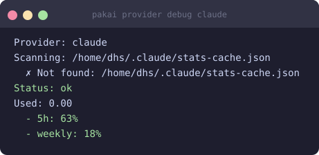

# Claude

Track your Claude Pro / Max subscription usage directly from pakai.

## Overview

| | |
|---|---|
| **Provider ID** | `claude` |
| **Data source** | Claude OAuth API + `~/.claude/stats-cache.json` |
| **Windows** | 5-hour, weekly |
| **Unit** | messages |

## Prerequisites

The [Claude CLI](https://claude.ai/download) must be installed and you must be logged in:

```bash
claude login
```

pakai reads credentials from `~/.claude/` (the same location the Claude CLI stores them).

## Enable / setup

Claude is auto-detected when `~/.claude/stats-cache.json` exists. Run:

```bash
pakai setup
```

to confirm detection and start the daemon.

## Configuration

```bash
# Optional: set a message limit for percentage display
# (pakai reads the real limit from the API when available)
pakai config set provider.claude.limit 100

# Disable Claude from all outputs (pakai stops fetching it)
pakai config set provider.claude.enabled false

# Pin Claude to show its percentage first in compact outputs
pakai config set widget.pinned claude
```

Config file: `$XDG_CONFIG_HOME/pakai/config.toml`

## Result



## Troubleshooting

| Error | Fix |
|---|---|
| `~/.claude/stats-cache.json not found` | Run `claude login` or open Claude CLI at least once |
| `usage fetch failed: 401` | Token expired — run `claude login` again |
| `0% / no usage` on a fresh session | Stats-cache populates after the first Claude session; wait 60 s |
