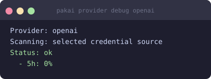

# OpenAI Codex

Track your OpenAI Codex (chatgpt.com) subscription usage.

## Overview

| | |
|---|---|
| **Provider ID** | `openai` |
| **Data source** | `~/.codex/auth.json` OAuth (chatgpt.com API) |
| **Windows** | 5-hour, weekly |
| **Unit** | messages |

## Prerequisites

The [OpenAI Codex CLI](https://github.com/openai/codex) must be installed and logged in:

```bash
codex login
```

This writes credentials to `~/.codex/auth.json`.

## Enable / setup

Codex is auto-detected when `~/.codex/auth.json` exists. Run:

```bash
pakai setup
```

to confirm detection.

## Configuration

```bash
# Set a message limit for percentage display
pakai config set provider.openai.limit 20

# Disable Codex from all outputs
pakai config set provider.openai.enabled false

# Hide Codex from widgets only (still fetched in the background)
pakai config set widget.hidden openai
```

Config file: `$XDG_CONFIG_HOME/pakai/config.toml`

## Result



## Troubleshooting

| Error | Fix |
|---|---|
| `~/.codex/auth.json not found` | Run `codex login` |
| `usage fetch failed: 401` | Token expired — run `codex login` again |
| `no usage` even when using Codex | The chatgpt.com API may take up to 60 s to reflect usage |
