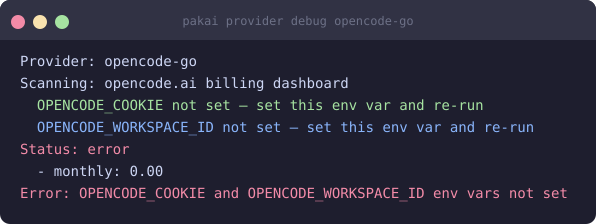

# OpenCode Go (web dashboard)

Track usage from the [opencode.ai billing dashboard](https://opencode.ai/workspace) — the same percentages shown in the web UI.

## Overview

| | |
|---|---|
| **Provider ID** | `opencode-go` |
| **Data source** | opencode.ai web dashboard (HTTP scrape) |
| **Windows** | 5-hour, weekly, monthly |
| **Unit** | percent (from the dashboard) |

## Prerequisites

You need two values from the opencode.ai web dashboard:

1. **Session cookie** — open `opencode.ai`, open DevTools (F12) → Application → Cookies → copy the value of the session cookie.
2. **Workspace ID** — visible in the URL: `opencode.ai/workspace/<workspace-id>`.

## Enable / setup

Set the two environment variables, then run `pakai setup`:

```bash
export OPENCODE_COOKIE="your-session-cookie-value"
export OPENCODE_WORKSPACE_ID="your-workspace-id"
pakai setup
```

To persist them, add to a `.env` file in the directory where you run pakai, or export from your shell profile.

pakai loads `.env` from the current directory automatically.

## Configuration

```bash
# Set a dollar limit (optional — the web dashboard shows native percentages)
pakai config set provider.opencode-go.limit 60

# Disable if you prefer the local DB provider
pakai config set provider.opencode-go.enabled false
```

Config file: `$XDG_CONFIG_HOME/pakai/config.toml`

## Result



## Troubleshooting

| Error | Fix |
|---|---|
| `OPENCODE_COOKIE and OPENCODE_WORKSPACE_ID env vars not set` | Export the two vars or create a `.env` file |
| `usage fetch failed: 401` | Session cookie expired — grab a fresh one from DevTools |
| `usage fetch failed: 404` | Workspace ID is wrong — copy it again from the URL |
