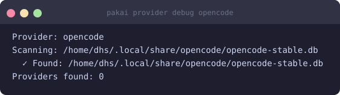

# OpenCode (local)

Track OpenCode usage from the local SQLite database. Automatically discovers all provider backends (Anthropic, OpenAI, …) as sub-providers.

## Overview

| | |
|---|---|
| **Provider ID** | `opencode` |
| **Data source** | `~/.local/share/opencode/opencode-stable.db` (or `opencode.db`) |
| **Windows** | 5-hour, weekly, monthly |
| **Unit** | USD (per-sub cost estimation) |
| **Sub-providers** | `opencode/anthropic`, `opencode/openai`, … (auto-discovered) |

## Prerequisites

[OpenCode](https://opencode.ai) must be installed and have been used at least once (to create the local DB). No additional login step is required for pakai — it reads the DB directly.

## Enable / setup

pakai auto-detects the DB path. Run:

```bash
pakai setup
```

If OpenCode is installed but the DB isn't found, check the path:

```bash
ls ~/.local/share/opencode/
```

## Configuration

```bash
# Set a monthly dollar limit (used for percentage display)
pakai config set provider.opencode.limit 60

# Per-window limits default from opencode.ai docs (5h=$12, weekly=$30, monthly=$60)
# Override any window limit:
pakai config set provider.opencode.limit 80

# Disable from outputs
pakai config set provider.opencode.enabled false
```

Config file: `$XDG_CONFIG_HOME/pakai/config.toml`

## Result



## Sub-providers

Each backend OpenCode has used appears as `opencode/<backend>` in `pakai status`.
Each sub-provider gets its own percentage bar derived from shared limits.

```bash
# View all discovered sub-providers
pakai provider debug opencode
```

## Troubleshooting

| Error | Fix |
|---|---|
| `opencode.db not found` | Install OpenCode and use it once |
| `no usage` even after using OpenCode | DB path may differ — check `ls ~/.local/share/opencode/` |
| Sub-providers show `$0` | The DB has sessions but no cost rows yet; run a prompt through OpenCode |
