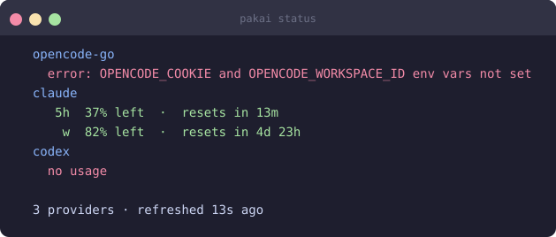

# CLI status

Human-readable per-provider breakdown, printed to the terminal.

## Usage

```bash
pakai status          # formatted, color-coded output
pakai status --json   # machine-readable JSON array
```

## Output format

Each provider block shows:
- Provider name
- Per-window usage: `5h`, `w` (weekly), `month`
- Percentage left and time until reset
- Error message if the provider is unavailable

## Result



## Configuration

```bash
# Change warning / critical color thresholds (% used)
pakai config set thresholds.warning 50
pakai config set thresholds.critical 80

# Change the separator between providers in compact outputs
pakai config set display.separator " | "
```

## JSON output

`pakai status --json` returns a JSON array — useful for scripting:

```bash
pakai status --json | jq '.[] | select(.provider == "claude") | .windows'
```
