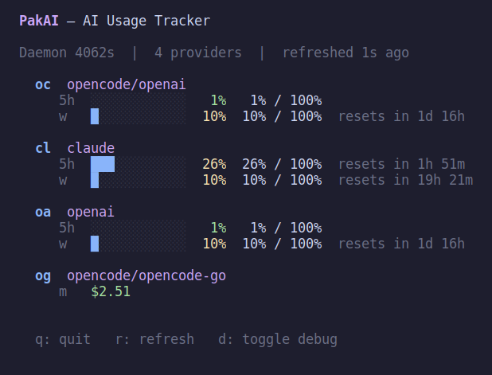

# TUI Dashboard

Full-screen interactive terminal dashboard with live updates.

## Usage

```bash
pakai dashboard
```

## Features

- Per-provider cards with per-window progress bars (5h / weekly / monthly)
- Live refresh every 30 s (or press `r`)
- Toggle debug view showing raw JSON (`d`)
- OpenCode sub-providers grouped under their parent
- Color-coded severity: green → yellow → red
- Reserve projection on monthly windows

## Keybindings

| Key | Action |
|---|---|
| `q` | Quit |
| `r` | Force refresh |
| `d` | Toggle debug (raw JSON) |

## Result



## Configuration

```bash
# Pin a provider to always show first
pakai config set widget.pinned claude

# Hide a provider (removes it from the dashboard)
pakai config set widget.hidden openai

# Hide from dashboard display only (still fetched)
pakai config set widget.hidden "openai,opencode-go"
```
