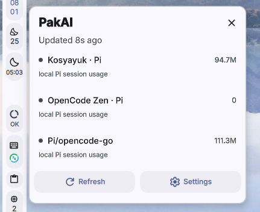
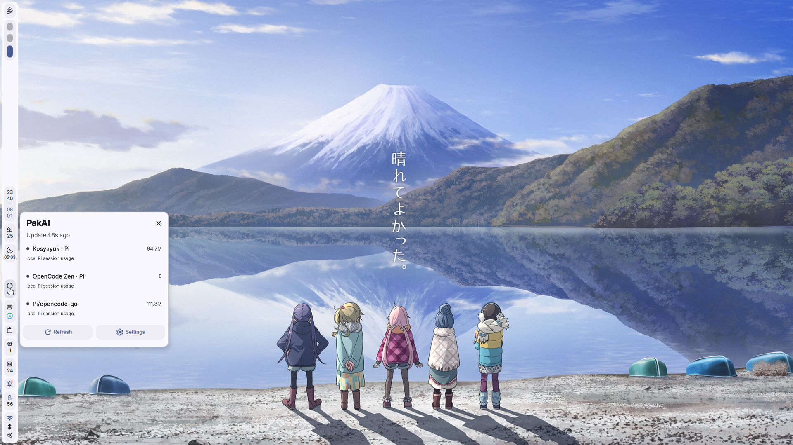

# DankMaterialShell (DMS)

Native DankBar plugin that follows the active DMS light, dark, or custom theme.

## Install

```bash
mkdir -p ~/.config/DankMaterialShell/plugins
ln -s "$PWD/dms/com.dhanifudin.pakai" ~/.config/DankMaterialShell/plugins/pakai
dms ipc call plugin-scan scan
```

Then enable **PakAI** in DMS Settings → Plugins, and add it to the DankBar layout.

## Features

- Follows the active DMS theme (light / dark / custom)
- Popout shows provider windows, reset times, and errors
- **Refresh** and **Settings** actions in the popout
- Settings opens DMS's plugin configuration (no manual file editing needed)

## Plugin configuration (via DMS Settings)

| Setting | Default | Description |
|---|---|---|
| Daemon URL | `http://localhost:7731` | pakai daemon address |
| Cache refresh interval | `30` | Seconds between fetches |
| Bar label | _(empty)_ | Optional label shown in DankBar |

## Screenshots





## Troubleshooting

| Error | Fix |
|---|---|
| Plugin not appearing after scan | Verify the symlink: `ls ~/.config/DankMaterialShell/plugins/pakai` |
| "Cannot connect to daemon" | Run `pakai daemon start` |
| Stale data | Click Refresh in the popout, or lower the cache interval in plugin settings |
