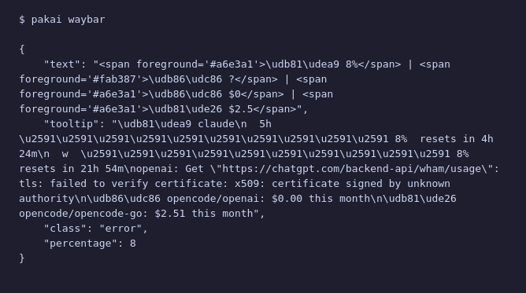

# KDE Plasma Widget

Native Plasma 6 applet for KDE desktops.

## Install

```bash
cp -r plasma/com.dhanifudin.pakai ~/.local/share/plasma/plasmoids/
plasmashell --replace &    # or log out and back in
```

**Add to panel:** Right-click panel → "Add or Remove Widgets" → search "PakAI" → drag to panel.

## Features

- **Compact mode**: colored dot + percentage in the panel
- **Pin a provider**: show its percentage directly in the panel bar
- **Expanded popup**: provider cards with per-window progress bars (5h / weekly / monthly)
- **OpenCode sub-providers**: grouped with per-sub progress bars
- **30 s auto-refresh** with manual refresh button
- **Reserve projection** on monthly windows
- **Error state** with daemon connection diagnostics

## Screenshot



## Configuration

```bash
# Pin a provider to show its % in the panel compact text
pakai config set widget.pinned claude

# Hide providers from the widget popup
pakai config set widget.hidden "openai,opencode-go"

# Reset
pakai config set widget.pinned ""
pakai config set widget.hidden ""
```

The widget connects to the pakai daemon at `http://localhost:7731`. If the daemon is not running, the widget shows an error with a reconnect button.

```bash
# Check daemon status
pakai daemon status

# Restart daemon
pakai daemon stop && pakai daemon start
```
