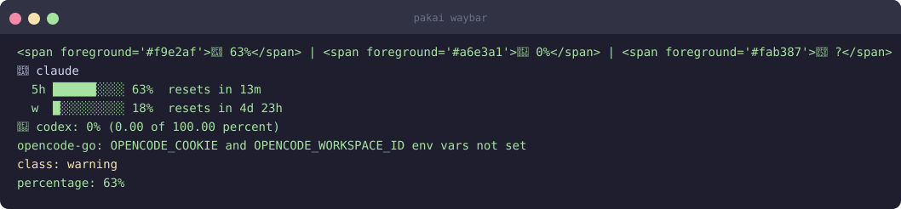

# Waybar

JSON module for Waybar (Sway, Hyprland, i3). Includes text, tooltip, CSS class, and percentage.

## Setup

Add to your Waybar config:

```jsonc
"custom/pakai": {
    "exec": "/home/user/go/bin/pakai waybar",
    "return-type": "json",
    "interval": 60,
    "format": "{}",
    "tooltip": true
}
```

Or generate the snippet:

```bash
pakai setup waybar
```

## CSS classes

Add to your Waybar stylesheet:

```css
#custom-pakai.ok       { color: #a6e3a1; }  /* green */
#custom-pakai.warning  { color: #f9e2af; }  /* yellow */
#custom-pakai.critical { color: #f38ba8; }  /* red */
#custom-pakai.over-limit {
  color: #f38ba8;
  font-weight: bold;
}
```

## Output format



The JSON fields:
- `text` — compact string shown in the bar
- `tooltip` — full per-provider breakdown on hover
- `class` — worst severity across all providers (`ok` / `warning` / `critical` / `over-limit`)
- `percentage` — worst numeric percentage (for bar modules)

## Configuration

```bash
# Change polling interval (seconds)
pakai config set daemon.poll_interval 30

# Adjust thresholds that control the CSS class
pakai config set thresholds.warning 50
pakai config set thresholds.critical 80
```

## Screenshot


